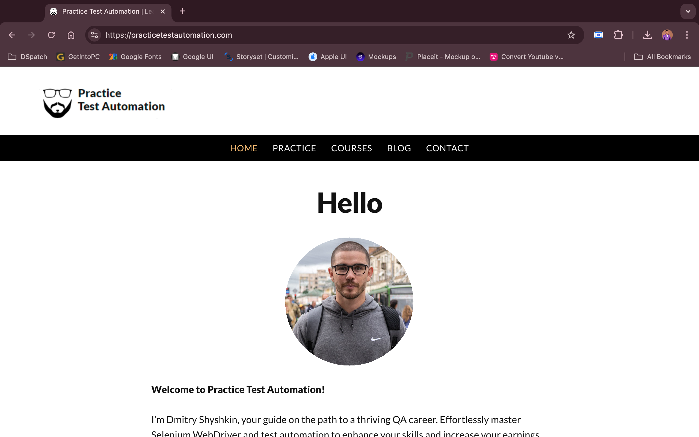
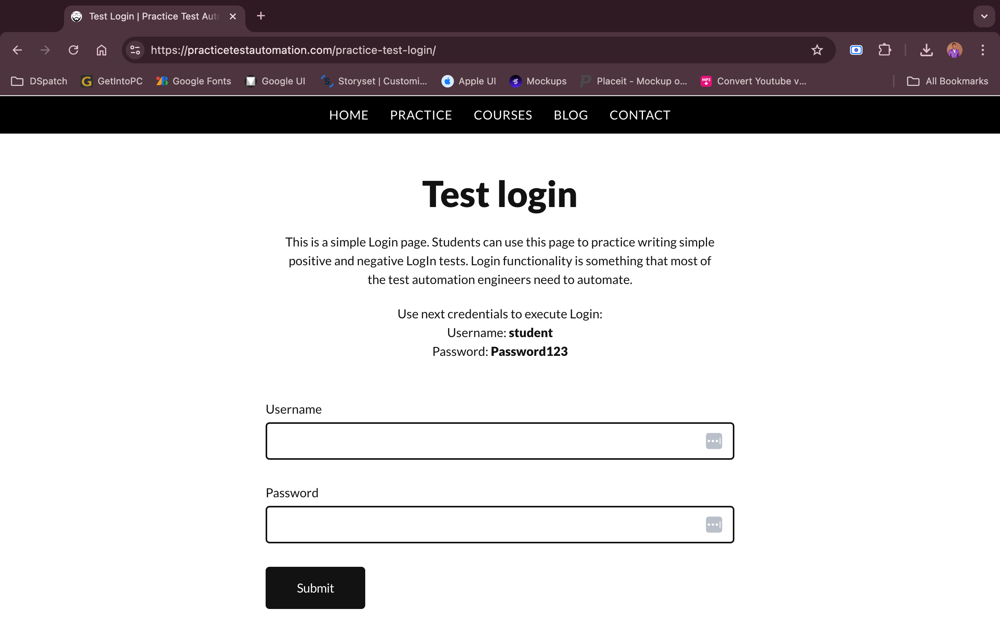

# Selenium Test Automation with Pytest (Data-Driven Testing)

This project showcases a **Data-Driven Testing (DDT)** approach using `Selenium` and `pytest` for testing the login functionality of the website [Practice Test Automation](https://practicetestautomation.com/). This approach allows you to run the same test with various data sets, ensuring comprehensive test coverage.





[](https://youtu.be/7AdCcdn0epM?si=QbgjP_CbrCrBWdkN)

## Prerequisites

Before running the tests, ensure you have the following installed on your system:

1. **Python 3.7+**: Ensure Python is installed. You can download it from [python.org](https://www.python.org/downloads/).
2. **Google Chrome**: Download and install Chrome from [here](https://www.google.com/chrome/).
3. **ChromeDriver**: Download the appropriate ChromeDriver from [ChromeDriver Downloads](https://sites.google.com/chromium.org/driver/). Ensure it's added to your system's PATH.

## Installation

Follow these steps to set up the project:

1. Clone the repository or download the project files.

2. Install the required Python dependencies. You can do this by running the following command:

    ```bash
    pip install -r requirements.txt
    ```

3. Verify that ChromeDriver is installed and available in your system's PATH.

## Data-Driven Testing Structure

This project utilizes **Data-Driven Testing (DDT)** with the `@pytest.mark.parametrize` decorator to manage different test scenarios. This approach allows for running the same test with various sets of input data, improving test coverage and robustness.

- **Test File**: Contains test cases that utilize `@pytest.mark.parametrize` to handle various login scenarios, including valid and invalid credentials.

## Folder Structure

```
selenium_pytest_project/
│
├── tests/                  # Contains the test cases
│   └── test_login.py       # Pytest test cases using Data-Driven Testing
│
├── ref/                    # Folder for storing images
│   └── Img_1.png           # Screenshot of the website
    └── Img_2.png
    └── Img_3.png
    └── Img_4.png
    └── thumbnail.png
│
├── requirements.txt        # Lists project dependencies
└── README.md               # This documentation
```

## Running the Tests

### 1. Positive Login Test

This test case verifies the correct login functionality using valid credentials.

```bash
pytest -k test_login
```

### 2. Negative Login Test: Invalid Username

This test case checks the error message displayed when an invalid username is entered.

```bash
pytest -k test_login
```

### 3. Negative Login Test: Invalid Password

This test case checks the error message displayed when an invalid password is entered.

```bash
pytest -k test_login
```

## Test Cases Description

### `test_login`

- **Steps**:
  - Navigate to `https://practicetestautomation.com/practice-test-login/`.
  - Enter various sets of credentials.
  - Submit the form.
  - Verify the expected URL and page content based on the input credentials.

## Running All Tests

To run all the test cases together, you can simply execute:

```bash
pytest
```

## Notes

- This example uses `pytest.mark.parametrize` for simplicity. For more complex scenarios, consider using CSV files for data input.
- Explicit waits are recommended to ensure elements are interactable.
- Ensure that your ChromeDriver matches the version of Google Chrome installed on your system.

## Future Improvements

- **CSV Integration**: For handling more extensive data sets.
- **Enhanced Error Handling**: Add better exception handling and logging.
- **Utility Functions**: Introduce utilities for managing wait times and retries.

This code demonstrates a basic Data-Driven Testing approach. While there are opportunities for improvement, such as better exception handling and advanced data management, this example serves as a starting point for utilizing DDT in your test automation suite.